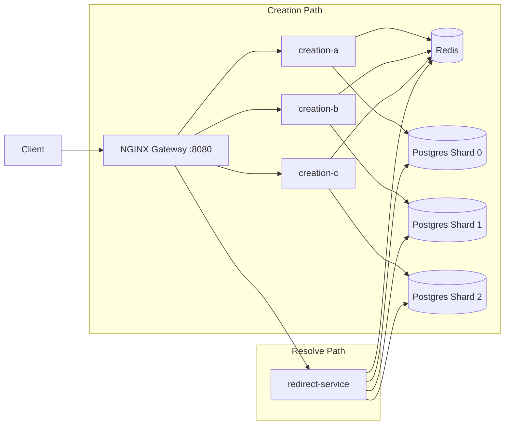
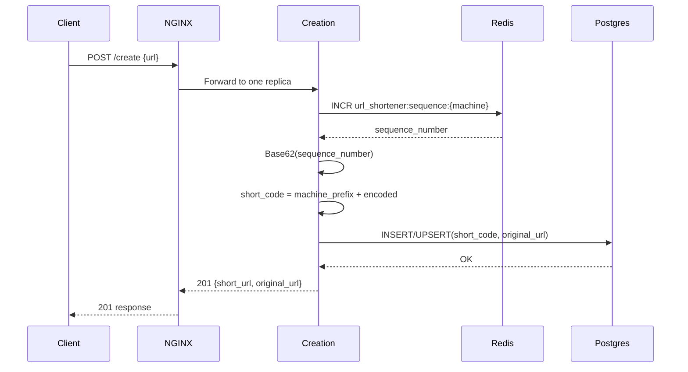
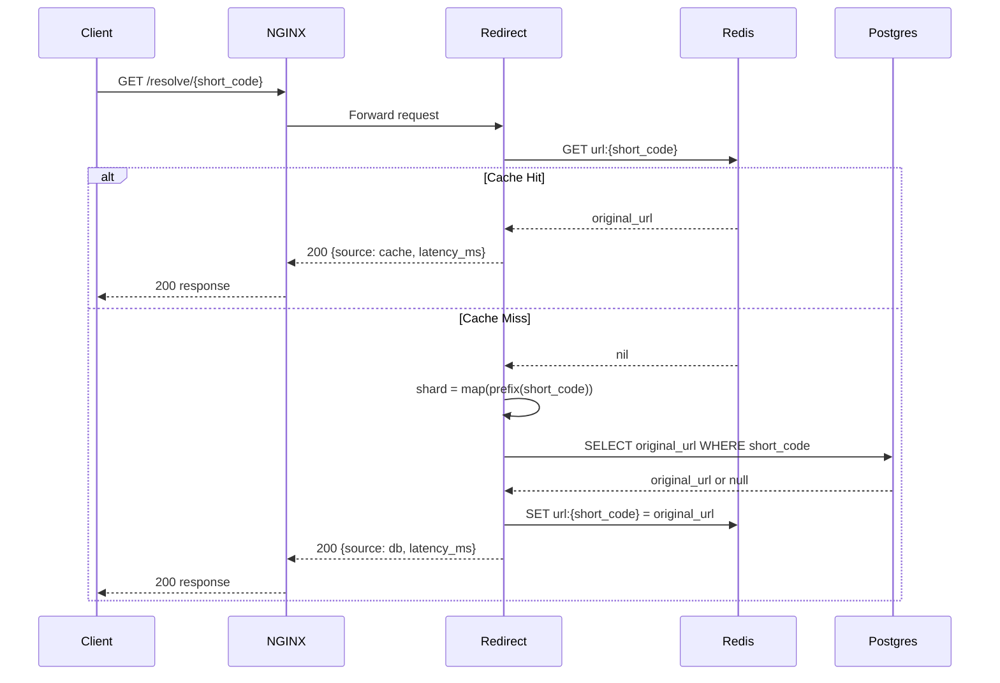

# URL Shortener - Backend System Design

## 1. Problem Statement
This system generates short URLs and resolves them at low latency under concurrent traffic.

Primary backend goals:
- Generate unique short codes safely across multiple creation replicas.
- Route reads through cache first, then durable storage.
- Scale write and read paths independently.
- Keep architecture explicit and easy to reason about during demos/interviews.

## 2. High-Level Architecture
The backend is a containerized distributed system behind NGINX.

Core runtime components:
- `nginx` (entry gateway / reverse proxy)
- `creation-service` replicas: `creation-a`, `creation-b`, `creation-c`
- `redirect-service` single lookup/redirect service
- `redis` for sequence generation and cache-aside reads
- `postgres-shard-0`, `postgres-shard-1`, `postgres-shard-2`

Deployed via `Backend/docker-compose.yml`.

### 2.1 Component Diagram


## 3. Topology and Routing
NGINX config (`Backend/nginx/nginx.conf`) defines two upstream clusters:
- `creation_service_cluster`: `creation-a:8000`, `creation-b:8000`, `creation-c:8000`
- `redirect_service_cluster`: `redirect:8000`

Route map:
- `POST /create` -> creation cluster (load-balanced)
- `GET /resolve/{short_code}` -> redirect service
- `GET /{short_code}` -> redirect service (HTTP 302 redirect endpoint)

External exposed port:
- Host `8080` -> NGINX `80`

## 4. Service Responsibilities
### 4.1 Creation Service
Files:
- `Backend/services/creation-service/main.py`
- `Backend/services/creation-service/short_url_creation_service.py`
- `Backend/services/creation-service/short_url_generator.py`
- `Backend/services/creation-service/postgres_repository.py`
- `Backend/services/creation-service/config.py`

Responsibilities:
- Validate incoming URL (`HttpUrl` in FastAPI model).
- Generate unique short code.
- Persist `(short_code, original_url)` to the correct PostgreSQL shard.
- Return deterministic JSON response.

Endpoint:
- `POST /create`

Response shape:
```json
{
  "short_url": "a1B2c",
  "original_url": "https://example.com/some/path"
}
```

### 4.2 Redirect Service
Files:
- `Backend/services/redirect-service/main.py`
- `Backend/services/redirect-service/redirect_lookup_service.py`
- `Backend/services/redirect-service/postgres_repository.py`
- `Backend/services/redirect-service/config.py`

Responsibilities:
- Resolve short code to original URL.
- Serve from Redis cache when possible.
- Fallback to PostgreSQL shard based on short-code prefix.
- Repopulate cache on DB hit.
- Expose both analytics response and real redirect endpoint.

Endpoints:
- `GET /resolve/{short_code}` -> returns source + latency stats
- `GET /{short_code}` -> returns HTTP `302` redirect

## 5. Data Partitioning Strategy (Sharding)
The first character of the short code is a machine prefix (`a`, `b`, or `c`).

Creation-side mapping (`creation-service/config.py`):
- `a -> shard 0`
- `b -> shard 1`
- `c -> shard 2`

Redirect-side resolution (`redirect-service/config.py`):
- Extract first character from short code.
- Map prefix to the same shard DSN.

Result:
- No central lookup table is required to locate shard.
- Routing to shard is O(1) from short code itself.

## 6. ID Generation and Uniqueness Model
Generation logic (`short_url_generator.py`):
1. Read service replica identity from env var `MACHINE_ID` (`a`/`b`/`c`).
2. Increment Redis counter key: `url_shortener:sequence:{MACHINE_ID}`.
3. Base62 encode the incremented number.
4. Prefix encoded sequence with machine id.

Example:
- machine `a`, sequence `125` -> base62 `21` -> short code `a21`

Why this avoids collisions:
- Sequence monotonic per machine prefix (Redis `INCR` atomicity).
- Distinct machine prefixes isolate key spaces.

## 7. Caching Strategy
Pattern used: cache-aside on resolve path.

Flow in `redirect_lookup_service.py`:
1. Try `Redis GET url:{short_code}`.
2. If hit -> return immediately (`source="cache"`).
3. If miss -> query mapped Postgres shard.
4. If found in DB -> `Redis SET url:{short_code}`.
5. Return DB result (`source="db"`).

Benefits:
- Fast repeated reads.
- Reduced Postgres pressure for hot URLs.

## 8. Data Model
Schema (`Backend/services/creation-service/schema.sql`):

```sql
CREATE TABLE IF NOT EXISTS url_mappings (
    short_code VARCHAR(32) PRIMARY KEY,
    original_url TEXT NOT NULL,
    created_at TIMESTAMPTZ NOT NULL DEFAULT NOW()
);
```

Write behavior:
- Upsert on `short_code` conflict (`ON CONFLICT ... DO UPDATE`).

## 9. End-to-End Request Flows
### 9.1 Create Flow (`POST /create`)
1. Client calls NGINX `/create`.
2. NGINX forwards to one creation replica.
3. Service validates URL.
4. Service generates short code via Redis sequence + Base62.
5. Service selects shard from `MACHINE_ID`.
6. Service inserts mapping into shard DB.
7. Service returns short code + original URL.

### 9.2 Resolve Analytics Flow (`GET /resolve/{code}`)
1. Client calls NGINX `/resolve/{code}`.
2. Redirect service checks Redis cache key `url:{code}`.
3. If miss, service determines shard from code prefix and queries Postgres.
4. On DB hit, service writes back to Redis.
5. Response includes:
   - `original_url`
   - `source` (`cache` or `db`)
   - `server_latency_ms`

### 9.3 Redirect Flow (`GET /{code}`)
1. Same lookup logic as resolve.
2. Returns HTTP `302` to `original_url`.

### 9.4 Sequence Diagram: Create Request


### 9.5 Sequence Diagram: Resolve Request (Cache Hit/Miss)


### 9.6 Algorithm Choices and Trade-offs

#### 9.6.1 Short Code Generation
Chosen algorithm:
- `short_code = machine_prefix + base62(redis_incr_per_machine)`

Rationale:
- Redis `INCR` provides atomic monotonic counters, preventing duplicate sequence values per machine prefix.
- Prefix partitioning (`a`, `b`, `c`) isolates ID spaces and embeds shard routing information into the key itself.
- Base62 minimizes output length while staying URL-friendly.

Complexity:
- Redis increment: `O(1)`.
- Base62 encode: `O(log_62 N)` where `N` is current sequence magnitude.

Trade-offs:
- Generated IDs are predictable (not opaque/random like UUIDv4).
- Prefix range limits direct shard namespace unless new prefixes are introduced.

#### 9.6.2 Shard Routing
Chosen algorithm:
- Route by first character of short code.

Rationale:
- Constant-time shard resolution (`O(1)`) with no metadata lookup service.
- Keeps redirect path simple and low-latency.

Trade-offs:
- Requires strict contract that all issued short codes preserve prefix semantics.

#### 9.6.3 Read Path Strategy
Chosen algorithm:
- Cache-aside: `GET Redis` -> miss -> `SELECT Postgres` -> `SET Redis`.

Rationale:
- Optimizes repeated reads and lowers DB pressure.
- Preserves DB as source of truth.
- Degrades gracefully if Redis is unavailable (service can still query Postgres).

Trade-offs:
- First access after write can be a cache miss.
- Requires cache TTL/invalidation policy if update/delete semantics are added later.

#### 9.6.4 Persistence Semantics
Chosen algorithm:
- PostgreSQL upsert (`ON CONFLICT ... DO UPDATE`) on `short_code`.

Rationale:
- Idempotent under retries.
- Avoids duplicate-key hard failures in transient retry scenarios.

Trade-offs:
- Last-write-wins semantics if same short code is reissued.

## 10. Error Handling Model
Creation service maps domain errors to HTTP:
- Dependency issues (Redis/Postgres unavailable) -> `503`
- Persistence failures -> `500`
- Generic creation failure -> `500`

Redirect service:
- Not found -> `404`
- Dependency issues -> `503`
- Lookup/internal errors -> `500`

## 11. Deployment and Runbook
### 11.1 Start the backend stack
From `Backend/`:
```bash
docker compose up -d --build
```

### 11.2 Apply schema to shards
Script:
- `Backend/services/creation-service/apply_schema.py`

This applies `schema.sql` to `SHARD_0_DSN`, `SHARD_1_DSN`, and `SHARD_2_DSN`.

### 11.3 Public gateway URL
- `http://localhost:8080`

## 12. API Contract (Backend)
### Create
- Method: `POST`
- Path: `/create`
- Body:
```json
{ "url": "https://example.com" }
```
- Success: `201`

### Resolve (stats)
- Method: `GET`
- Path: `/resolve/{short_code}`
- Success: `200`
- Response example:
```json
{
  "short_code": "a1B2c",
  "original_url": "https://example.com",
  "source": "cache",
  "server_latency_ms": 1.23
}
```

### Redirect
- Method: `GET`
- Path: `/{short_code}`
- Success: `302`


## 13. Directory Map (Backend Focus)
- `Backend/docker-compose.yml`: service topology and env wiring.
- `Backend/nginx/nginx.conf`: gateway routing and upstream config.
- `Backend/services/creation-service/`: create pipeline, generation, persistence.
- `Backend/services/redirect-service/`: resolve + redirect + cache-aside.

---
This README intentionally emphasizes backend architecture and system design behavior over frontend setup.
